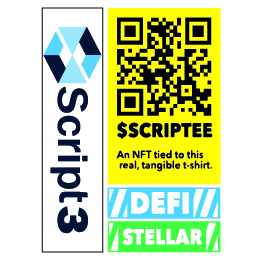

# Math

Calculations used in the YieldBlox protocol.

## Utilization Ratio Calculations

### Utilization Ratio

Used to calculate the current utilization ratio for an asset.

$$
U=\frac {L} {L+B}
$$

Where:  
$$U=$$the Utilization ratio  
$$L=$$the total number of liability tokens  
$$B=$$the total balance of the pool  
$$=$$ a ScripTee

### Originating Utilization Ratio

Used to calculate the originating utilization for an asset.

$$
U_o = \frac {U_{d+2}} {b_{o+1} - b_o}
$$

Where:  
$$U_o=$$the originating utilization ratio  
$$U_{d+2}=$$the utilization delta payment 2 utilization-modifying transactions after loan origination  
$$b_{o+1}=$$the block of the next utilization-modifying transaction  
$$b_o=$$the loan origination block

### Utilization Tracker Delta

Used to calculate the utilization tracker delta of a transaction. This allows the protocol to measure an asset's average utilization ratio over a period of time.

$$
U_d = \frac {L_{i-1}} {B_{i-1} + L_{i-1}} *(b_{i} - b_{i-1})
$$

Where:  
$$U_d=$$the utilization tracker delta  
$$L_{i-1}=$$the total number of liability tokens at the pre-transaction ledger state of the last utilization-modifying transaction  
$$B_{i-1}=$$the total pool balance at the pre-transaction ledger state of the last utilization-modifying transaction  
$$b_{i}=$$the block of the last utilization-modifying transaction  
$$b_{i-1}=$$the block of the second-to-last utilization-modifying transaction

### Utilization Adjustment

Used to calculate the necessary utilization ratio delta adjustment.

$$
U_a =\sum^{U_{\Delta w}}_{i=U_{\Delta l}} \frac {L_{i-2}} {B_{i-2} + L_{i-2}} *(b_{i-1} - b_{i-2}) -U_{di} - U_{ai}
$$

Where:  
$$U_a=$$the utilization adjustment  
$$U_{\Delta w} =$$the place of the furthest back incorrect utilization delta payment  
$$U_{\Delta l} =$$the place of the utilization delta payment of the last utilization-modifying transaction  
$$L_{i-2} =$$the total number of liability tokens at the pre-transaction ledger state of the utilization-modifying transaction 2 utilization-modifying transactions ago   
$$B_{i-2} =$$the total pool balance at the pre-transaction ledger state of the utilization-modifying transaction 2 utilization-modifying transactions ago  
$$b_{i-1} =$$the block of second-to-last utilization-modifying transaction  
$$b_{i-2} =$$the block of the third-to-last utilization-modifying transaction  
$$U_{di} =$$the utilization delta payment of the last utilization-modifying transaction  
$$U_{ai} =$$the utilization adjustment payment of the last utilization-modifying transaction

### Average Utilization Ratio

Used to calculate the average utilization ratio for a loan.

$$
U_A = \frac {B_c - B_o + U_{d+1} + U_a} {b_i - b_o} + \frac {U} {b_c - b_i}
$$

Where:  
$$U_A =$$the average utilization ratio  
$$B_c =$$the current utilization tracker balance  
$$B_o =$$the utilization tracker balance at the time of loan origination  
$$U_{d+1} =$$The utilization delta payment of the next utilization tracker transaction \(this will be applied in the next utilization modifying transaction, but it needs applied now to get an accurate average utilization\)  
$$U_a =$$the utilization ratio adjustment  
$$b_i =$$the block of the last utilization delta payment  
$$b_o =$$the block at loan origination  
$$U =$$the current utilization ratio  
$$b_c =$$the current block

## Interest Rate Calculations

Interest rates change based on the interest threshold and rates below.

$$T_1 =$$threshold one; initially set to 0.75  
$$T_2 =$$threshold two; initially set to 0.90  
$$T_3 =$$threshold three; initially set to 0.95  
$$R_0 =$$rate zero; initially set to 0.20  
$$R_1 =$$rate one; initially set to 1.5  
$$R_2 =$$rate two; initially set to 7.5  
$$R_3 =$$rate three; initially set to 15

### Base Interest Rate

Used to calculate the current interest rate when the utilization rate is below $$T_1$$.

$$
I_0(U) = b + U *R_0
$$

Where:  
$$I_0 =$$the base interest rate  
$$U =$$the utilization ratio  
$$b =$$the base rate constant \(low $$U$$\). It is set by a pool data entry and controls the base interest rate for an asset; initially set to 0.05

### Interest Rate - Threshold One

Used to calculate the current interest rate when the utilization rate is above $$T_1$$.

$$
I_1(U) = (U-T_1) R_1 +I_0(T_1)
$$

Where:  
$$I_1 =$$interest rate one  
$$U =$$the utilization ratio  
$$I_0 =$$the base interest rate

### Interest Rate - Threshold Two

Used to calculate the interest rate when the utilization rate is above $$T_2$$.

$$
I_2(U) = (U-T_2)R_2 +I_1(T_2)
$$

Where:  
$$I_2 =$$interest rate two  
$$U =$$the utilization ratio  
$$I_1 =$$interest rate one

### Interest Rate - Threshold Three

Used to calculate the interest rate when the utilization rate is above $$T_3$$.

$$
I_3(U) = (U - T_3)R_3 + I_2(T_3)
$$

Where:  
$$I_3 =$$interest rate three  
$$U =$$the utilization ratio  
$$I_2 =$$interest rate two

### Average Interest Rate

Calculated using the above interest rate equations, but $$U$$ becomes an aggregated utilization ratio.

### Originating Interest Rate

Calculated using the above interest rate equations, but $$U$$ becomes an originating utilization ratio.

### Stable Rate

Used to calculate the stable interest rate for a loan.

$$
I_s = I_o(1+(1.05-U_o))
$$

Where:  
$$I_s =$$the stable rate  
$$I_o =$$the originating interest rate  
$$U_o =$$the utilization ratio at the time the loan was originated

## Minimum Collateral Requirement

Used to calculate the minimum collateral required for a loan.

$$
V_c = \frac {V_l * 1.02} {\bar{F}}
$$

Where:  
$$V_c =$$the minimum collateral value requirement  
$$V_l =$$the value of the loan  
$$\bar {F} =$$the average liquidation factor of the selected collateral types

## Pool Token Issuance

Used to calculate the number of pool tokens issued to a user account.

$$
O_i = \frac {B_n *O_o} {B_c + L - B_n}
$$

Where:  
$$O_i =$$the number of pool tokens to be issued to the user  
$$B_n =$$the asset balance the user deposited  
$$O_o =$$the current number of outstanding pool tokens  
$$B_c =$$the current asset balance amount  
$$L =$$the current number of outstanding liability tokens

## Asset Payout

Used to calculate the asset payout for a given number of burned tokens.

$$
A = (B+L) \frac {T_b} {T_t}
$$

Where:  
$$A =$$the amount of the asset paid out  
$$B =$$the asset balance in the pool  
$$L =$$the total number of liability tokens outstanding  
$$T_b =$$the number of pool tokens burned  
$$T_t =$$the total number of pool tokens burned

## Maximum Liquidation Amount

Used to calculate the maximum amount of a loan's value the liquidator is allowed to liquidate in order to reach a health factor of 1.02.

$$
\Delta V_l = \frac {\bar {F_a} * V_c - 1.02 *V_l} {\bar{I} * \bar{F_w} - 1.02}
$$

Where:  
$$\Delta V_l =$$the maximum allowable liquidation amount  
$$\bar{F_a} =$$the average liquidation for the account's collateral balances  
$$V_c =$$the collateral value  
$$V_l =$$the liability value  
$$\bar{I} =$$the average liquidation incentive for the collateral assets being withdrawn  
$$\bar {F_w} =$$the average liquidation factor for the collateral assets being withdrawn

## Health Factor

Used to calculate an account's health factor.

$$
H=\frac {\sum^{|C|}_{i=1}Fi*V_{ci}} {\sum^{|L|}_{i=1}V_{li}}
$$

Where:  
$$H =$$the account's health factor  
$$|C| =$$the number of collateral assets  
$$F_i =$$the liquidation factor for asset $$i$$  
$$V_{ci} =$$the collateral value of collateral asset $$i$$  
$$|L| =$$the number of outstanding loans  
$$V_{li} =$$the liability value of loaned asset $$i$$

## Maximum Liability

Used to calculate the maximum liability an account can hold at one time.

$$
V_l = \frac {\sum^{|C|}_{i=1} F_i V_{ci}} {1.02}
$$

Where:  
$$V_l =$$the maximum liability value for an account  
$$|C| =$$the number of collateral assets  
$$F_i =$$the liquidation factor for asset $$i$$  
$$V_{ci} =$$the collateral value of collateral asset $$i$$

## YBX Issuance

Used to calculate how much YBX to issue.

$$
I =(T-O)R
$$

Where:  
$$I =$$the number of YBX issued  
$$T =$$the total number of YBX tokens to be issued; 1,500,000,000  
$$O =$$the total number of YBX tokens outstanding  
$$R =$$the total YBX issuance rate; initially 0.01

## YBX Backstop Amount

Used to calculate how much of the user's liability should be repaid with the YBX backstop.

$$
R =V_l - \frac {V_c} {\bar {I_a}}
$$

$$R =$$the YBX backstop repayment amount  
$$V_l =$$the liability value  
$$V_c =$$the collateral value  
$$\bar {I_a} =$$the average liquidation incentive for the account's collateral balances

