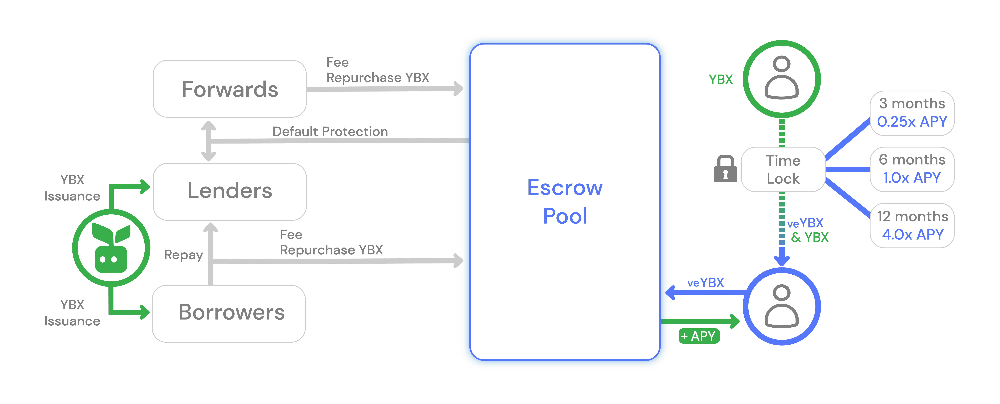

# Escrowing

## What is escrowing?

Escrowing is locking [YBX tokens](ybx-tokens/) for a period of time in exchange for voting escrowed YBX tokens, veYBX.

## Why would I escrow?

YieldBlox users escrow their [YBX tokens](ybx-tokens/) in exchange veYBX, a non-transferrable asset which is used to vote on YieldBlox [governance proposals](governance.md). Governance proposals can determine key protocol functionalities like upgrades, asset supports, YBX issuance allocations, and more! YBX issuance can even be allocated to YBX escrows. Basically, users can earn YBX tokens passively and control protocol development -- just for having YBX.

## How does escrowing work on YieldBlox?

[YBX token](ybx-tokens/) holders can escrow their YBX in exchange for veYBX. Their YBX is locked for a 3 month, 6 month, or 12 month time period in the YBX escrow pool. After the escrow lockup ends, the user reclaims their locked YBX and exchanges their veYBX for a portion of the YBX earned by YBX escrows.

The protocol also allows users to unlock any escrowed YBX before the time period is up. However, all veYBX associated with the escrow will be burned and the user will receive no YBX for it. Further, there is a small penalty applied to avoid potential voting exploits. This penalty will be initially set at 10%.

## How do I escrow on YieldBlox?

If a user holds any [YBX tokens](ybx-tokens/), they can escrow them using the YieldBlox protocol.

Currently, you can escrow YBX for three different lock periods. Each of these lock periods correlates to a different amount of veYBX you will be issued per YBX locked.

| Lock Period |   veYBX Issuance   |
| :---------: | :----------------: |
|  3 months   | 0.25 veYBX per YBX |
|  6 months   | 1.00 veYBX per YBX |
|  12 months  | 4.00 veYBX per YBX |

Consider the example where a user whishes to escrow lock 100 YBX for 3 months. Once they escrow-lock the YBX through the YieldBlox protocol, their YBX is locked in a claimable balance only the protocol can claim. They also receive 25 veYBX in their account they can now use to vote in [governance proposals](governance.md).

## How do I unlock escrowed YBX on YieldBlox?

A user can unlock any escrowed YBX they have through the YieldBlox protocol.

If the escrowed position has completed the Lock Period associated with it, unlocking returns the full amount of YBX to the user _plus_ any fees or emissions earned by escrow locked YBX. These fees are captured by converting the veYBX issued by the escrowed position into YBX!

If the escrowed position has NOT completed the Lock Period associate with it, unlocking works a bit differently. They receive the original escrow amount, minus an early unlock penalty set by [YieldBlox Governance](governance.md), and do not receive any YBX for their burned veYBX.

## How much YBX will I receive for my veYBX upon unlock?

YBX escrows may receive a portion of YBX issuance if the governance system votes to allocate a portion of issuance to escrows through an [allocation proposal](governance.md). Additionally, YBX escrows may receive a portion of interest fees if the governance system passes a governance proposal to increase YBX escrow fee allocation, it is currently set at 0. Fees allocated to escrows are converted into YBX.

When a user's escrow is unlocked and their veYBX is exchanged for YBX the amount of YBX they receive is equal to the total YBX earned by escrows divided by total veYBX outstanding times the amount of veYBX exchanges, the equation is shown [here](../technical-docs/math.md#veYBX-Unlock-Value). This means they receive a proportion of ALL YBX earned by escrows, not just the YBX earned while they were escrowing. This means their veYBX value will fluctuate as other users lock and unlock escrows. This formula favors user's who continually compound their escrow position by re-escrowing all YBX earned from the veYBX exchange.
