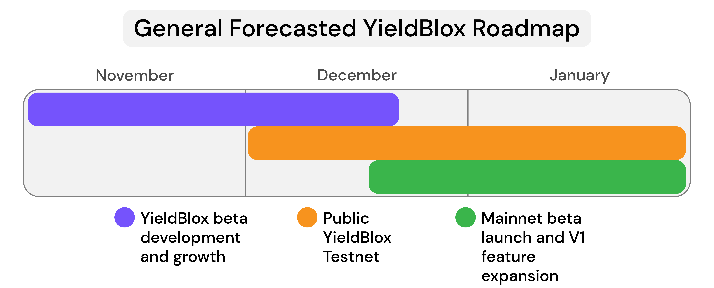

# General

## What is YieldBlox?

YieldBlox is a decentralized finance (DeFi) protocol for lending and FX forwards built on [Stellar](https://www.stellar.org) using [Stellar Turrets](https://tss.stellar.org). The protocol has functions for [lending](lending-borrowing/), [borrowing](lending-borrowing/borrowing.md), [margin accounts](margin-accounts.md), [FX forwards](fx-forwards.md), and [staking](staking.md). Users carry out all protocol functions using YieldBlox's smart contracts.

## What is a decentralized finance protocol?

A decentralized finance protocol is a protocol that operates using decentralized, immutable smart contracts and does not rely on any intermediary organizations to function. YieldBlox is decentralized because it uses the Stellar Turret smart contract protocol to function. Our team has no control over the protocol after it is deployed, and if we cease to exist, the protocol will continue to function perfectly well without us. This means that all assets deposited in the protocol are only under the control of the users who deposited them. The protocol is completely non-custodial.

## What is unique about YieldBlox?

The DeFi money market landscape has become very competitive. There are a variety of money market protocols build on programmable blockchains like Ethereum and Solana. Nevertheless, YieldBlox has made several improvements on existing money market protocol models and created a unique offering.&#x20;

**Extreme Capital Efficiency**

Capital efficiency is crucial for any money market protocol. Protocols must make depositor's capital as useful as possible to maintain high interest rates. YieldBlox handles this by lending assets in three different through traditional overcollateralized [borrowing](lending-borrowing/borrowing.md), [margin accounts](margin-accounts.md), and whitelisted [lines of credit](lending-borrowing/lines-of-credit.md). In addition, lent assets are used to size FX forward markets.

**Unique Tokenomics**

Tokenomics, when designed correctly, can be an invaluable tool for a DeFi protocol. The protocol's platform token allows users to benefit from the long-term success protocol and can be used to perform essential protocol functions. YBX, YieldBlox's platform token, accomplishes this with a [five-level tokenomics model](ybx-tokens/ybx-tokenomics.md) that allows YBX holders to shape and benefit from every aspect of the YieldBlox protocol. In addition, it performs the crucial function of serving as a reserve asset that eliminates counterparty risk for users through [YBX default protection](ybx-tokens/ybx-backstop.md).&#x20;

**Built on Stellar**

YieldBlox is the first DeFi protocol built on Stellar. Stellar is a perfect platform for DeFi protocols with extremely fast transactions, low fees, and an ecosystem that is well equipped to tokenize real-world currencies and assets. Additionally, Stellar's focus on developing countries means YieldBlox will be able to serve a user base that has traditionally been hard for DeFi protocols to tap into.&#x20;

## What are the benefits of YieldBlox?

YieldBlox brings a decentralized, on-ledger money market to the Stellar ecosystem.\
Within the ecosystem, this promises to:

* Increase and trading payment liquidity
* Provide ledger-level yield product
* Reduce reliance on lending intermediaries like banks
* Serve a global market with a cost of less than $0.01 per loan or forward

## What is the motivation for YieldBlox?

YieldBlox was created under the same motivation as [Stellar](https://www.stellar.org): to bring equitable economic access to the entire world. Too many people are underserved by the global economy and don't have access to the financial functions that banks and other lending intermediaries provide.

YieldBlox hopes to erase these barriers by providing an easy-to-use [lending](lending-borrowing/) and [FX forwards](fx-forwards.md) web app. Along with this, Yieldblox will improve Stellar Ecosystem liquidity and offer a trust-free yield-earning product.

## How do I use YieldBlox?

All a user needs to do to use YieldBlox is connect their Stellar wallet to the YieldBlox web app. From there, they can use its entire functionality by interacting with the protocol's smart contracts.

YieldBlox currently supports the following wallets:

* ****[**LOBSTR**](https://lobstr.co)****
* ****[**Freighter**](https://www.freighter.app)
* ****[**Albedo**](https://albedo.link)
* ****[**Rabet**](https://rabet.io)****

More technical users can also use YieldBlox through our API or by sending requests directly to the turrets hosting our protocol smart contracts.

## Does YieldBlox have fees?

While they are very small, YieldBlox does have two types of fees:

**Network Fees**

YieldBlox users must pay [Stellar Network fees](https://developers.stellar.org/docs/glossary/fees/) and Stellar Turret fees for each transaction. Both of these fees are extremely low. We expect them to amount to less than one cent (< $0.01) per transaction.

**Interest Rates**

Borrowers on YieldBlox must pay [interest fees](lending-borrowing/interest-rates.md) to lenders. These fluctuate based on demand.

## Can YieldBlox be changed or upgraded?

Yes. The YieldBlox protocol can be changed or updated using its [governance](governance.md) model.

## How does governance work?

The YieldBlox protocol is updated and maintained using a [governance](governance.md) token model. Users receive [YBX tokens](ybx-tokens/) for lending or borrowing, and these tokens can be [staked](staking.md) and then used to make and vote on protocol updates and changes.

## What's a YBX token?

[YBX](ybx-tokens/) is YieldBlox's platform token. It is issued to those who use the protocol, and it can be [staked](staking.md) to earn a portion of protocol revenue and propose and vote on [governance](governance.md) proposals to modify the protocol.

## Are there risks when using YieldBlox?

Every application ever created has some risk. With YieldBlox, the risks are smart contract and liquidation related. A smart contract vulnerability would be a bug in the protocol code. The risk of liquidation is user-specific and an intended function of the protocol. To mitigate risks, our team has taken every imaginable step to ensure the security of our protocol. The YieldBlox protocol is currently seeking third-party audits, and will have a bug bounty to further ensure security.

## YieldBlox Roadmap (General)

Below is a high-level roadmap of what the Script3 team has planned for the YieldBlox protocol.

