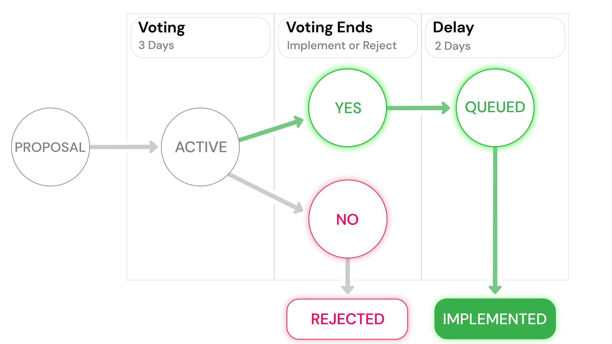

# Governance

## How does governance work on YieldBlox?

The YieldBlox protocol is updated and maintained using a governance token model. Users receive [YBX tokens](ybx-tokens/) for [lending](lending-borrowing/) or borrowing, and these tokens can be [staked](staking.md) for sYBX. sYBX tokens have governance power that can be used to make and vote on protocol updates and changes.

## How does the protocol change?

The YieldBlox protocol is controlled by [YBX token](ybx-tokens/) stakers. Holders of [sYBX tokens](staking.md#what-is-staking) can propose, vote on, and implement changes to the protocol. Proposals can modify existing protocol parameters or add entirely new functionalities to the protocol.

Once a user submits a proposal to change the protocol, users have three days to vote on whether to implement or reject the proposal. If the proposal is accepted for implementation, it is queued with a 2-day time delay before being implemented.

## How does voting work?

Users have three days to vote on proposals. They vote 'YES' or 'NO' on proposed protocol updates or changes using a voting smart contract. The number of votes each user has is equal to the amount of sYBX they hold. 

If the vote passes \(60% of votes are YES at the end of the voting period\), the proposal status data entry is changed to “approved.” If it does not pass, the proposal account is deleted. A proposal vote must reach a quorum of at least 5% of outstanding governance tokens to pass.

## Who can vote?

Anyone who [stakes](staking.md) [YBX tokens](ybx-tokens/) can vote.

## How are governance proposals created?

Creating a proposal generates a governance transaction and a proposal account controlled by the governance contract. The proposal account stores the proposed update’s transaction XDR and the proposal status \(either voting or approved\) in the account data entries.

## Who can create a proposal?

Governance proposals can be created by any user account staking more than 0.01% of [YBX tokens](ybx-tokens/).

## Standard Governance Proposals

### YBX Incentive Allocations

YBX incentive allocations are set by governance proposals. These proposals are initiated using a `incentiveAllocation` operation in the governance smart contract. These governance proposals differ from standard governance proposals in that instead of voting `YES` or `NO` they vote on allocating incentives for lending or borrowing a certain asset. For example, if a user wants more incentives to be allocated to XLM lenders, they will use their sYBX to submit `LENDING_XLM` votes. At the end of the voting period, the governance proposal shifts incentive allocation to match the distribution of votes. For example, say USDC and XLM are the only assets supported by the protocol and at the end of the voting period there are 600 votes for `LENDING_XLM` 400 votes for `BORROWING_XLM` 500 votes for `LENDING_USDC` and 500 votes for `BORROWING_USDC`. 30% of YBX incentives will be allocated to XLM lenders, 20% will be allocated to XLM borrowers, 25% will be allocated to USDC lenders, and 25% will be allocated USDC borrowers. This creates a strong incentive for users to vote for whatever assets they are currently lending or borrowing so make sure you vote on these proposals!

Incentive allocation proposals differ in that the voting period for these proposals is 7 days to give every sYBX holder a chance to vote and there is no queue period. After voting ends the proposal is immediately implemented! Furthermore, only one of these proposals can exist at a time and a new one can be created as soon as the old one is concluded. 

### Replacing a Signer

One risk of the [Stellar Turrets](https://tss.stellar.org/) protocol is bad turrets popping up. This risk is mitigated because the YieldBlox governance token holders choose the protocol's turrets for its functions. The protocol governance smart contract includes a`replaceSigner` operation. In emergencies, this can be used to remove one server's signing key and replace it with a different server's key. 

Unlike governance proposal functions, this function does not have voting or queue periods. As soon as the proposal account reaches 15% of governance tokens voting YES, the proposal will be implemented. This operation can only be ran twice per day to prevent abuse.

### Freezing Protocol Smart Contracts

The other main risk of the [Turrets](https://tss.stellar.org/) protocol is a bug in the YieldBlox smart contracts. While our team has thoroughly tested our smart contracts and had them audited, it is still possible a bug slips through the cracks. To protect against this possibility, the governance smart contract includes a  `freezeContract` operation. This freezes a specified smart contract and prevents it from being ran. This contract gives users the ability to quickly freeze a smart contract if a bug is found in it to minimize damage.

Like the `revokeSigner` option, this proposal does not have a voting or queue period. As soon as the proposal account reaches 15% of governance tokens voting YES, the proposal will be implemented. This operation can be reversed using either a governance function or a freeze protocol operation.

