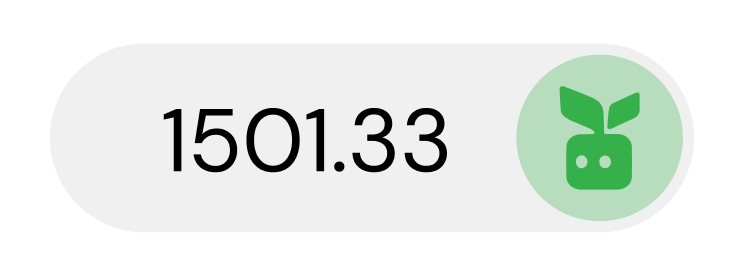

# Staking

## What is staking?

Staking is setting aside and locking up [YBX tokens](ybx-tokens/) for a period of time in exchange for staking tokens, sYBX.

## Why would I stake?

YieldBlox users stake their [YBX tokens](ybx-tokens/) for sYBX to earn interest on their staked YBX tokens and the ability to vote on YieldBlox [governance proposals](governance.md). Basically, users can earn YBX tokens passively and control protocol development-- just for having YBX.

## How does staking work on YieldBlox?

[YBX token](ybx-tokens/) holders can stake their YBX in exchange for sYBX. Their YBX is locked for a 3 month, 6 month, or 1 year time period in the YBX staking pool. After the staking lockup ends, the user can exchange their sYBX for the original amount of YBX they staked plus the APR earned over the lock period. 

Staking APR is generated by protocol fees. A portion of protocol fees is used to repurchase YBX on the Stellar DEX and send it to the YBX staking pool. This staking pool is proportionally distributed to sYBX holders when their staking period ends. Through this repurchase mechanism, YBX stakers earn a portion of protocol revenue.

## How do I stake on YieldBlox?

If a user holds any [YBX tokens](ybx-tokens/), they can stake them on the YieldBlox web app.

When a user connects their [wallet](general.md#what-do-i-need-to-use-yieldblox), their Account Overview will be on the first section of every page. The rightmost section of the Account Overview is _Staked YBX_. This section will show the real-time interest earned by staking YBX, the amount of staked YBX \(sYBX\) the account has, and the amount of YBX the account has.

Once the 'Manage' button is selected, a staking modal will appear. There, a user can enter the amount of the YBX they'd like to stake and the time period they'd like to stake it for. A user can stake their YBX for three months, six months, or a year -- the longer it's staked, the more interest a user gets. 

Staking for 3 months has a 0.80x yield multiplier, staking for 6 months has a 1.00x yield multiplier, and staking for 1 year has a 1.50x yield multiplier. After users decide on a yield multiplier, they select 'Submit' and sign the transaction in their wallet.

In the example above, a user stakes 100 YBX. The yield multiplier is multiplied by the lockup period multiplier and the number of staked YBX. The lockup period multiplier is based on one year \(e.g. 1 year has a lockup period multiplier of 1, 6 months \(1/2 year\) has a lock-up period multiplier of 0.5, etc.\). This product is the number of sYBX tokens a user will receive for staking \(equation below\). If they stake for 3 months, they will receive 20 sYBX. If they stake for 6 months, they will receive 50 sYBX. If they stake for 1 year, they will receive 150 sYBX.

$$
sYBX_{received} = Y * L * YBX_{staked}
$$

Where:  
$$Y=$$ the yield multiplier  
$$L=$$ the lockup period  
$$YBX_{staked} =$$ the YBX staked

Technical users can also stake by using the YieldBlox API or by interacting with our smart contracts directly through Stellar Turrets.

## How do I unstake on YieldBlox?

If a user wishes to unstake their YBX, they should select the 'Manage' button in the staking section of their Account Overview. The staking modal will appear. Once there, the user should toggle to 'Unstake.'

A user will be shown how much sYBX they have unlocked. This number is the amount of sYBX the user can unstake for YBX. They will also be shown their next unlock period -- how long they have until they can unstake their next YBX stake. 

To unstake, users will enter the amount of unlocked sYBX they wish to unstake. When this is entered, they will be shown how much YBX they will receive for unstaking. Then they should select 'Submit' and sign the transaction in their wallet.

Technical users can also unstake by using the YieldBlox API or by interacting with our smart contracts directly through Stellar Turrets.

## Can I unstake early?

Yes. Users can unstake early if they want to receive the original amount of YBX they staked. However, they will forfeit the interest they earned over the staking period so far.

To unstake early, a user should select 'Unstake early' in the staking modal \(with the 'Unstake' toggle selected\). This will bring up another modal, verifying the user understands the terms of unstaking early. The user should select 'Submit' and sign the transaction in their wallet.

## Does staking on YieldBlox make me a validator?

Yes. By staking on YieldBlox, you're validating our life choices.  

