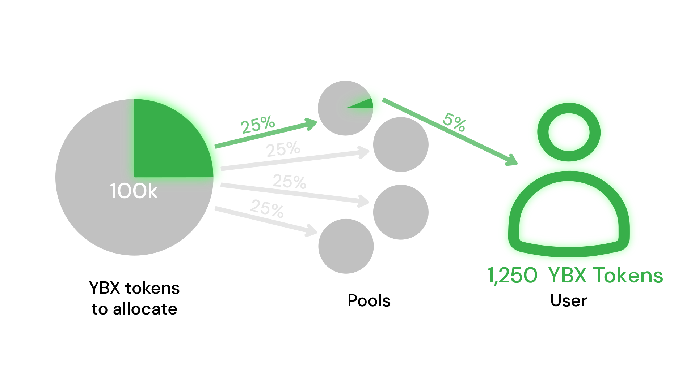
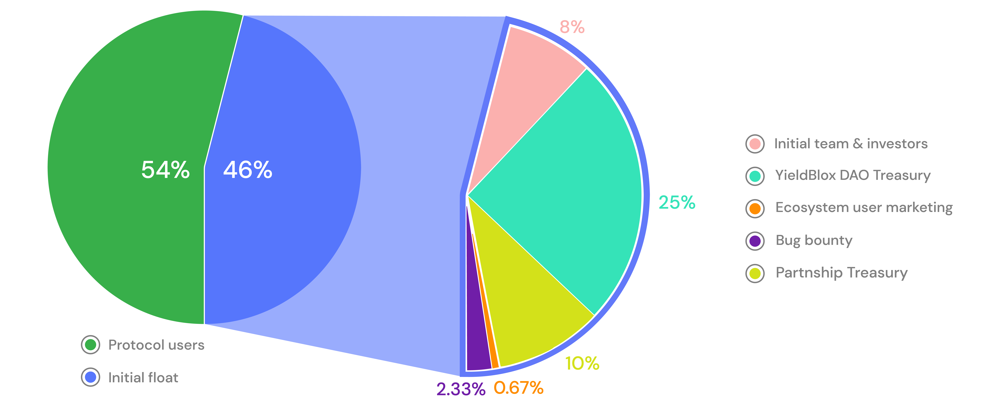

# YBX Tokens

## What are YBX tokens?

YBX tokens are the YieldBlox protocol's platform tokens. They can be used to earn a portion of protocol fees and vote on protocol governance proposals. YBX holders control the future of the protocol.

## How many YBX tokens are there?

There are a total of 1,500,000,000 YBX tokens to be allocated.

## How do I get YBX tokens?

Users receive YBX tokens just for using YieldBlox. They must claim them to receive their issued YBX.

## How do I claim my issued YBX tokens?

If a user has been issued YBX tokens, they will be able to see how many they have been issued in the top right corner of the YieldBlox web app. To claim, a user should hover over this number and then select 'claim,' as it appears. We recommend claiming issued YBX weekly.

.png>)

## Can I buy YBX tokens?

Yes. The main way to receive YBX tokens is to [lend](../lending-borrowing/) or borrow on YieldBlox, but YBX tokens are Stellar tokens, so anyone can trade them on the [Stellar DEX](https://www.stellar.org/tools?locale=en#trade-on-the-stellar-dex).

## What can I do with YBX tokens?

Users can [stake](../staking.md) YBX tokens in exchange for sYBX. sYBX allows users to earn a portion of protocol fees as well as [vote](../governance.md#how-does-voting-work) on and create governance [proposals](../governance.md#how-are-protocol-change-proposals-created).&#x20;

## How are YBX tokens distributed?

YBX tokens are distributed daily to users for [lending](../lending-borrowing/), [borrowing](../lending-borrowing/#how-does-borrowing-work-on-yieldblox), or [staking](../staking.md) on the YieldBlox protocol. Only users who have lent or borrowed originating more than a day before the distribution time are eligible for YBX token distribution on that date.

.svg>)

The YBX issuance equation is used to calculate the number of YBX tokens to distribute. Once this equation finds this distribution number, each lending pool will get a percentage of YBX tokens to be allocated based on that pool's assets' allocation percentages. Each asset's allocation percentage is a set constant controlled by YBX token holders. After a pool knows their asset's allocation percentage, YBX tokens are distributed to the lenders and borrowers of that pool on a proportion equal to the asset percentage they contributed to that pool.

_**Example visualized:**_

A user lent or borrowed on YieldBlox the week prior to _date x_. The issuance equation finds that 100,000 YBX tokens are to be issued on _date x_.

Now there are 100,000 YBX tokens to be allocated. Let's say there are four lending pools on YieldBlox at the start of _date x_, and they all have equal allocation percentages (25%). The user is in _Pool 1_, and they contributed 5% of the total assets in _Pool 1_. Then the total number of YBX tokens the user would receive is:

(YBX-issued) \* (Pool 1's allocation percentage) \* (User percentage contributed to Pool 1)

\= (100,000) \* (25%) \* (5%)

\= 1,250 YBX tokens

The user in this example would receive 1,250 YBX tokens on the distribution date of _date x_. These numbers are for explanatory purposes and may or may not reflect real YBX token issuance.

## What is the issuance equation?

The issuance equation is used to calculate the total tokens (YBX) to be issued for a given period. This equation is a negative inverse proportion function.

The number of tokens issued decreases as the number of outstanding tokens increases. The curve also adjusts for any additional issuance or burning of YBX tokens. Though, additional issuance can only occur through a governance proposal. See the issuance equation below:

$$
I=(T-O) * R
$$

Where:\
$$I=$$ the YBX issuance of the current period\
$$T=$$ the total number of YBX tokens to be issued; 1,500,000,000\
$$O=$$ the number of YBX tokens outstanding\
$$R=$$ the YBX issuance rate; initially 0.0075

## Is there an initial YBX token distribution?

Yes, there will be an initial distribution of YBX tokens. This initial float of governance tokens is represented as $$A_0$$in the governance issuance equation above. The distribution will be a total of 69,000,000 YBX tokens. It will be distributed to the YieldBlox DAO, early contributors to the YieldBlox protocol, a bug bounty, marketing efforts, and Stellar ecosystem members! The initial investor token allocation will be locked for a year, and the inital team allocation will be locked for 4 years following a linear unlock schedule with a one year cliff. The YieldBlox DAO Treasury allocation is directly controlled by the YieldBlox [governance system](../governance.md).

After the initial distribution, the remaining 810,000,000 YBX tokens will be distributed to protocol lenders and borrowers. So overall, 92% of all YBX tokens will be distributed directly to the community!&#x20;

## Will there be a YBX airdrop?

Yes! The initial distribution allocated to ecosystem user marketing will be partially distributed through an airdrop. The rest will be distributed through various giveaways.
