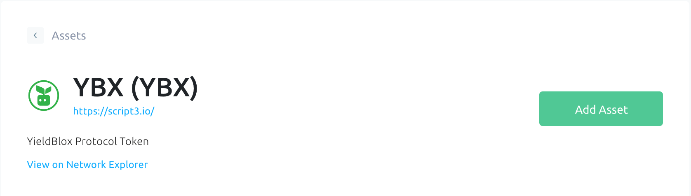

# YBX Airdrop Setup

## [Airdrop Announcement](https://script3.medium.com/)

## YBX Token

[Stellar Expert](https://stellar.expert/explorer/public/asset/YBX-GBUYYBXWCLT2MOSSHRFCKMEDFOVSCAXNIEW424GLN666OEXHAAWBDYMX)

Issuing Account: **GBUYYBXWCLT2MOSSHRFCKMEDFOVSCAXNIEW424GLN666OEXHAAWBDYMX**

Domain: [https://script3.io/](https://script3.io/)

## How to set up a trustline to YBX

To set up a trustline to YBX, a user must have a Stellar wallet because YBX is a custom Stellar asset.  
The easiest way to establish a trustline is with a [LOBSTR](https://lobstr.co/) wallet.

A trustline can also be established if a user prefers a [Freighter](https://www.freighter.app/), [Albedo](https://albedo.link/), or [Rabet](https://rabet.io/) wallet, but the user must go through the [Stellar Laboratory](https://laboratory.stellar.org/#?network=public) to set it up. See [this section](ybx-airdrop-setup.md#setting-up-a-trustline-with-stellar-lab) for instructions on this.

## Setting up a trustline with LOBSTR

* Go to the [YBX asset page on LOBSTR](https://lobstr.co/assets/YBX:GBUYYBXWCLT2MOSSHRFCKMEDFOVSCAXNIEW424GLN666OEXHAAWBDYMX).
* Verify the issuing account is `GBUYYBXWCLT2MOSSHRFCKMEDFOVSCAXNIEW424GLN666OEXHAAWBDYMX`
* Verify the issuing domain is [https://script3.io/](https://script3.io/)
* Select the _Add Asset_ button in the top right corner.

* A pop-up will appear asking if you wish to add the asset, select _Add_.

* YBX should then show up in your assets, and you have successfully established a YBX trustline with your LOBSTR wallet!

* Celebrate with pizza 🍕 

## Setting up a trustline with Stellar Lab

* Visit [Stellar Laboratory](https://laboratory.stellar.org/#?network=public).
* Ensure you are on the public network \(you can select your network with the toggle button in the top right corner\).

* Select the _Build Transaction_ button.
* Enter your public key on the box labeled _Source Account_. You can usually find your public key in the settings of most wallets. It is a long string of characters starting with 'G'

* Click the _Fetch next sequence number_ button.

* Click _Add Operation_ at the bottom of the screen, and add a _Change Trust_ operation.  Enter these asset details: **Alphanumeric 4** Asset code: **YBX** Issuing account: **GBUYYBXWCLT2MOSSHRFCKMEDFOVSCAXNIEW424GLN666OEXHAAWBDYMX** This will allow you to hold the YBX asset.

* Click the _Sign in Transaction Signer_ button.

* Then click _Submit in Transaction Submitter_.
* Add your account's secret key in the _Signature_ field. Your secret key can typically be found in your settings as well.

* On the next page, click _Submit Transaction_.
* If you get a message saying your transaction was successful, you have added a YBX trustline to your account!
* Celebrate with cake 🍰 

If you have any questions about setting up your YBX trustline, reach out to [support@script3.io](mailto:support@script3.io).

